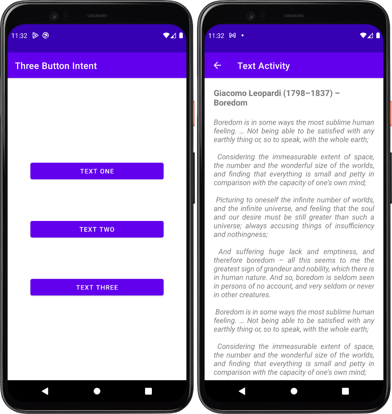

## Table of contents

- [Overview](#overview)
    - [The challenge](#the-challenge)
    - [Screenshot](#screenshot)
- [My process](#my-process)
    - [Built with](#built-with)
    - [What I learned](#what-i-learned)
    - [Continued development](#continued-development)
- [Author](#author)

## Overview

### The challenge

Users should be able to:

- Click on all the buttons and navigate to the text screen and from the top bar go back to the home screen.

### Screenshot

### Links

- Solution URL: [Solution](https://github.com/mlzzi/three-button-intent-app/)

## My process

### Built with

- Android Studio
- Java

### What I learned

### Continued development

I will continue to learn from the Google's platform and practice logic in a coding websites such CodeWars, HackerHank and LeetCode

## Author

- Linkedin - [Murilo Luzzi](https://www.linkedin.com/in/muriloluzzi/)
- GitHub - [@mlzzi](https://github.com/mlzzi)